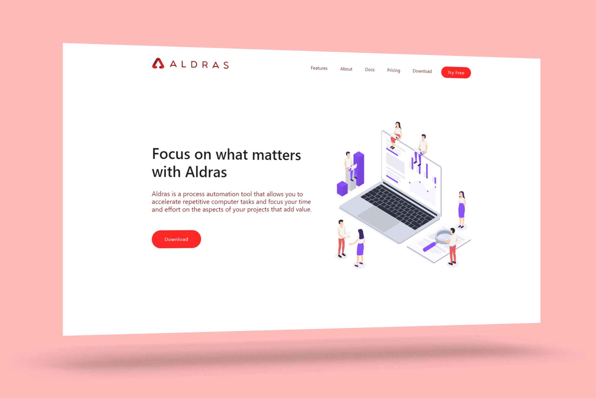
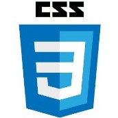
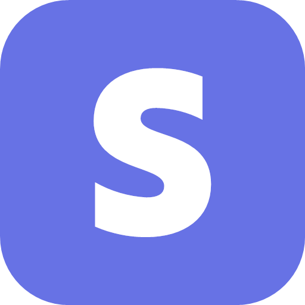

 

  

<h2 align="center">Aldras Website</h2>

  

    Full stack website for the Aldras application with user documentation, video tutorials, app download, and payment integration.
     
    <a href="https://aldras.netlify.com/"><strong>Explore »</strong></a>
     
     
    <a href="https://github.com/aldras-automation/aldras-website/issues">Report Bug</a>
    ·
    <a href="https://github.com/aldras-automation/aldras-website/issues">Request Change</a>
  

 

  
Table of Contents

  <ol>
    <li>
      <a href="#about-the-project">About The Project</a>
      <ul>
        <li><a href="#built-with">Built With</a></li>
        <li><a href="#versions">Versions</a></li>
        <li><a href="#app">App</a></li>
      </ul>
    </li>
    <li><a href="#getting-started">Getting Started</a></li>
    <li><a href="#contributing">Contributing</a></li>
    <li><a href="#license">License</a></li>
    <li><a href="#acknowledgments">Acknowledgments</a></li>
  </ol>

 

## About The Project
 

  

(<a href="#top">back to top</a>)

### Built With
 

   [HTML](https://en.wikipedia.org/wiki/HTML5)

   [CSS](https://en.wikipedia.org/wiki/CSS)

   [Vanilla JavaScript](https://en.wikipedia.org/wiki/CSS)

   [Stripe
  payment processing](https://stripe.com/)

  
  [Flask web framework](https://flask.palletsprojects.com/en/2.0.x/)
  
   [PythonAnywhere](https://www.pythonanywhere.com/)
  
  

 

### Versions

    The Aldras application was initially provided as a commercial application with code obfuscation and licensing.
      
    Since 2021, the Aldras application has been provided as an open-source project without code obfuscation and licensing.
      
    The commercial version of the application continues to exist as a separate branch as a portfolio project for archival reference purposes only. The <a href="https://github.com/aldras-automation/aldras-app/tree/open-source">open-source version</a>, not the commercial version should be utilized for normal use.

 

### App

    The code and documentation for the Aldras desktop application exists in a <a href="https://github.com/aldras-automation/aldras-app">separate repository</a>.

(<a href="#top">back to top</a>)

## Getting Started

To download the open-source version of the application for Windows, navigate to
[`aldras.netlifycom/download`](https://aldras.netlify.com/download) or download the `.exe`
installer from the repository.

For additional guidance getting started, feel free to review some of the [video
guides](https://aldras.netlifycom/video) or [written
documentation](https://aldras.netlifycom/docs).

(<a href="#top">back to top</a>)

## Contributing

If you have a suggestion that would improve the Aldras website, fork the repo
and create a pull request. You can also simply open an issue with the tag
"enhancement". Don't forget to give the project a star if you enjoy! Thank you!

1. Fork the Project
2. Create your Feature Branch (`git checkout -b feature/AmazingFeature`)
3. Commit your Changes (`git commit -m 'Add some AmazingFeature'`)
4. Push to the Branch (`git push origin feature/AmazingFeature`)
5. Open a Pull Request

(<a href="#top">back to top</a>)

## License

Distributed under the GNU GPLv3 License. See `LICENSE.txt` for more information.

(<a href="#top">back to top</a>)

## Acknowledgments

* Huge shout-out to [Adri Regalado](https://github.com/adrianaregalado) for her assistance and consultation throughout
 the product development cycle.

(<a href="#top">back to top</a>)
